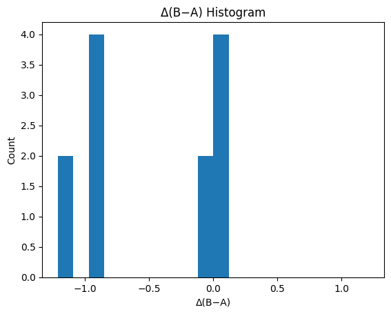
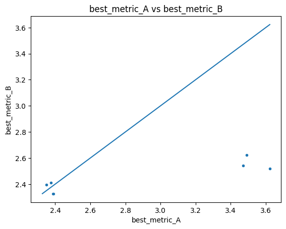
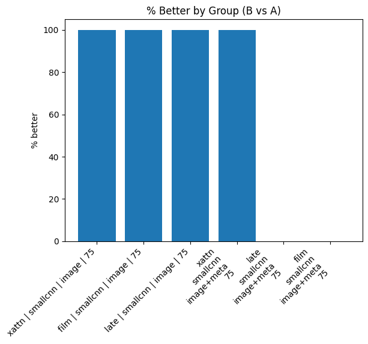
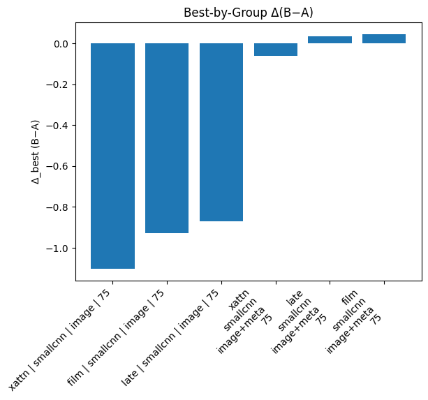

# Summary Comparison Report

**Source A:** `results/sweep/huge_sweep/adam_optim_2/adam_optim_2_single_summary_runs.csv`  
**Source B:** `results/sweep/huge_sweep/background/adam_optim/adam_optim_single_summary_runs.csv`  
**Metric:** `best_metric`  (lower is better: `True`)  
**Tie tolerance:** `0.01`  
**Matched on keys (27):** `activation_eps, backbone, batch_size, color_space, epochs, features, grad_clip, hidden_classes_cnt, lr, lr_auto, lr_schedule, meta_dim, meta_encoder, meta_layers, meta_model_name, meta_text_template, metric_kind, model, mse_space, mse_weight_epochs, mse_weight_start, optim, pred_activation, seed, val_split, weight_decay, workers`  
**Ignored columns:** `best_epoch, ckpt_path, run_id`

## At a Glance

- Rows in A: **12**
- Rows in B: **12**
- Unique (by match keys) in A: **12**
- Unique (by match keys) in B: **12**
- Matched: **12**
- Only in A: **0**
- Only in B: **0**

## Best Runs

- **Global best A**: best_metric = 2.3501
- **Global best B**: best_metric = 2.3267
- **Δ(B−A)** on global bests: -0.0234 → **better**

## Top‑K Best Runs within Each Summary

### Top‑K in A
| model   | backbone   | features   |   mse_weight_epochs |   best_metric |
|:--------|:-----------|:-----------|--------------------:|--------------:|
| film    | smallcnn   | image+meta |                  75 |       2.35006 |
| film    | smallcnn   | image+meta |                  75 |       2.35006 |
| late    | smallcnn   | image+meta |                  75 |       2.37568 |
| late    | smallcnn   | image+meta |                  75 |       2.37568 |
| xattn   | smallcnn   | image+meta |                  75 |       2.38813 |
| xattn   | smallcnn   | image+meta |                  75 |       2.38875 |
| film    | smallcnn   | image      |                  75 |       3.47031 |
| film    | smallcnn   | image      |                  75 |       3.47031 |
| late    | smallcnn   | image      |                  75 |       3.49255 |
| late    | smallcnn   | image      |                  75 |       3.49255 |

### Top‑K in B
| model   | backbone   | features   |   mse_weight_epochs |   best_metric |
|:--------|:-----------|:-----------|--------------------:|--------------:|
| xattn   | smallcnn   | image+meta |                  75 |       2.3267  |
| xattn   | smallcnn   | image+meta |                  75 |       2.3267  |
| film    | smallcnn   | image+meta |                  75 |       2.39517 |
| film    | smallcnn   | image+meta |                  75 |       2.39517 |
| late    | smallcnn   | image+meta |                  75 |       2.41201 |
| late    | smallcnn   | image+meta |                  75 |       2.41201 |
| xattn   | smallcnn   | image      |                  75 |       2.52045 |
| xattn   | smallcnn   | image      |                  75 |       2.52045 |
| film    | smallcnn   | image      |                  75 |       2.5418  |
| film    | smallcnn   | image      |                  75 |       2.5418  |

## Matched Verdicts & Δ Stats

- **better**: 8  
- **same**: 0  
- **worse**: 4  

### Delta Stats (B − A)

- mean: -0.4804
- median: -0.4666
- min: -1.1027
- max: 0.0451
- std: 0.5151
- q05/q25/q50/q75/q95: -1.1027 / -0.9285 / -0.4666 / 0.0363 / 0.0451

## Grouped Summary (Matched Head‑to‑Head)

_Grouped by:_ `model, backbone, features, mse_weight_epochs`

| model   | backbone   | features   |   mse_weight_epochs |   matched |   better |   same |   worse |   delta_mean |   delta_median |   pct_better |
|:--------|:-----------|:-----------|--------------------:|----------:|---------:|-------:|--------:|-------------:|---------------:|-------------:|
| xattn   | smallcnn   | image      |                  75 |         2 |        2 |      0 |       0 |   -1.10272   |     -1.10272   |          100 |
| film    | smallcnn   | image      |                  75 |         2 |        2 |      0 |       0 |   -0.928508  |     -0.928508  |          100 |
| late    | smallcnn   | image      |                  75 |         2 |        2 |      0 |       0 |   -0.871083  |     -0.871083  |          100 |
| xattn   | smallcnn   | image+meta |                  75 |         2 |        2 |      0 |       0 |   -0.0617391 |     -0.0617391 |          100 |
| late    | smallcnn   | image+meta |                  75 |         2 |        0 |      0 |       2 |    0.0363353 |      0.0363353 |            0 |
| film    | smallcnn   | image+meta |                  75 |         2 |        0 |      0 |       2 |    0.0451064 |      0.0451064 |            0 |

## Best by Group (A vs B Minima per Group)

| model   | backbone   | features   |   mse_weight_epochs |   best_metric_A_best |   best_metric_B_best |   delta_best_B_minus_A | verdict_best   |
|:--------|:-----------|:-----------|--------------------:|---------------------:|---------------------:|-----------------------:|:---------------|
| film    | smallcnn   | image      |                  75 |              3.47031 |              2.5418  |             -0.928508  | better         |
| film    | smallcnn   | image+meta |                  75 |              2.35006 |              2.39517 |              0.0451064 | worse          |
| late    | smallcnn   | image      |                  75 |              3.49255 |              2.62147 |             -0.871083  | better         |
| late    | smallcnn   | image+meta |                  75 |              2.37568 |              2.41201 |              0.0363353 | worse          |
| xattn   | smallcnn   | image      |                  75 |              3.62317 |              2.52045 |             -1.10272   | better         |
| xattn   | smallcnn   | image+meta |                  75 |              2.38813 |              2.3267  |             -0.0614277 | better         |

**Best-by-group verdicts:** better: 4, same: 0, worse: 2

## Plots

