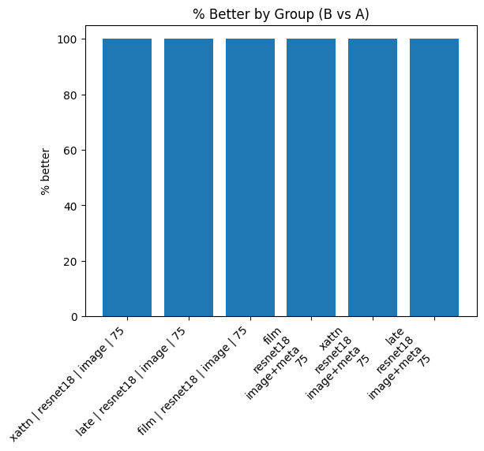

# Summary Comparison Report

**Source A:** `results/sweep/huge_sweep/no_background/sgd_optim_2/sgd_optim_2_single_summary_runs.csv`  
**Source B:** `results/sweep/huge_sweep/background/sgd_optim/sgd_optim_single_summary_runs.csv`  
**Metric:** `best_metric`  (lower is better: `True`)  
**Tie tolerance:** `0.01`  
**Matched on keys (27):** `activation_eps, backbone, batch_size, color_space, epochs, features, grad_clip, hidden_classes_cnt, lr, lr_auto, lr_schedule, meta_dim, meta_encoder, meta_layers, meta_model_name, meta_text_template, metric_kind, model, mse_space, mse_weight_epochs, mse_weight_start, optim, pred_activation, seed, val_split, weight_decay, workers`  
**Ignored columns:** `best_epoch, ckpt_path, run_id`

## At a Glance

- Rows in A: **12**
- Rows in B: **12**
- Unique (by match keys) in A: **12**
- Unique (by match keys) in B: **12**
- Matched: **12**
- Only in A: **0**
- Only in B: **0**

## Best Runs

- **Global best A**: best_metric = 2.7749
- **Global best B**: best_metric = 2.3898
- **Δ(B−A)** on global bests: -0.3850 → **better**

## Top‑K Best Runs within Each Summary

### Top‑K in A
| model   | backbone   | features   |   mse_weight_epochs |   best_metric |
|:--------|:-----------|:-----------|--------------------:|--------------:|
| late    | resnet18   | image+meta |                  75 |       2.77487 |
| late    | resnet18   | image+meta |                  75 |       2.77487 |
| xattn   | resnet18   | image+meta |                  75 |       2.88685 |
| xattn   | resnet18   | image+meta |                  75 |       2.88685 |
| film    | resnet18   | image+meta |                  75 |       3.18284 |
| film    | resnet18   | image+meta |                  75 |       3.18284 |
| late    | resnet18   | image      |                  75 |       3.56456 |
| late    | resnet18   | image      |                  75 |       3.56456 |
| xattn   | resnet18   | image      |                  75 |       3.63479 |
| xattn   | resnet18   | image      |                  75 |       3.63479 |

### Top‑K in B
| model   | backbone   | features   |   mse_weight_epochs |   best_metric |
|:--------|:-----------|:-----------|--------------------:|--------------:|
| xattn   | resnet18   | image      |                  75 |       2.38984 |
| xattn   | resnet18   | image      |                  75 |       2.38984 |
| xattn   | resnet18   | image+meta |                  75 |       2.39127 |
| xattn   | resnet18   | image+meta |                  75 |       2.39127 |
| late    | resnet18   | image+meta |                  75 |       2.44198 |
| late    | resnet18   | image+meta |                  75 |       2.44198 |
| film    | resnet18   | image+meta |                  75 |       2.59531 |
| film    | resnet18   | image+meta |                  75 |       2.59531 |
| late    | resnet18   | image      |                  75 |       2.59922 |
| late    | resnet18   | image      |                  75 |       2.59922 |

## Matched Verdicts & Δ Stats

- **better**: 12  
- **same**: 0  
- **worse**: 0  

### Delta Stats (B − A)

- mean: -0.7639
- median: -0.7722
- min: -1.2450
- max: -0.3329
- std: 0.3298
- q05/q25/q50/q75/q95: -1.2450 / -0.9653 / -0.7722 / -0.4956 / -0.3329

## Grouped Summary (Matched Head‑to‑Head)

_Grouped by:_ `model, backbone, features, mse_weight_epochs`

| model   | backbone   | features   |   mse_weight_epochs |   matched |   better |   same |   worse |   delta_mean |   delta_median |   pct_better |
|:--------|:-----------|:-----------|--------------------:|----------:|---------:|-------:|--------:|-------------:|---------------:|-------------:|
| xattn   | resnet18   | image      |                  75 |         2 |        2 |      0 |       0 |    -1.24495  |      -1.24495  |          100 |
| late    | resnet18   | image      |                  75 |         2 |        2 |      0 |       0 |    -0.965342 |      -0.965342 |          100 |
| film    | resnet18   | image      |                  75 |         2 |        2 |      0 |       0 |    -0.956849 |      -0.956849 |          100 |
| film    | resnet18   | image+meta |                  75 |         2 |        2 |      0 |       0 |    -0.587534 |      -0.587534 |          100 |
| xattn   | resnet18   | image+meta |                  75 |         2 |        2 |      0 |       0 |    -0.495574 |      -0.495574 |          100 |
| late    | resnet18   | image+meta |                  75 |         2 |        2 |      0 |       0 |    -0.332891 |      -0.332891 |          100 |

## Best by Group (A vs B Minima per Group)

| model   | backbone   | features   |   mse_weight_epochs |   best_metric_A_best |   best_metric_B_best |   delta_best_B_minus_A | verdict_best   |
|:--------|:-----------|:-----------|--------------------:|---------------------:|---------------------:|-----------------------:|:---------------|
| film    | resnet18   | image      |                  75 |              3.70776 |              2.75091 |              -0.956849 | better         |
| film    | resnet18   | image+meta |                  75 |              3.18284 |              2.59531 |              -0.587534 | better         |
| late    | resnet18   | image      |                  75 |              3.56456 |              2.59922 |              -0.965342 | better         |
| late    | resnet18   | image+meta |                  75 |              2.77487 |              2.44198 |              -0.332891 | better         |
| xattn   | resnet18   | image      |                  75 |              3.63479 |              2.38984 |              -1.24495  | better         |
| xattn   | resnet18   | image+meta |                  75 |              2.88685 |              2.39127 |              -0.495574 | better         |

**Best-by-group verdicts:** better: 6, same: 0, worse: 0

## Plots

