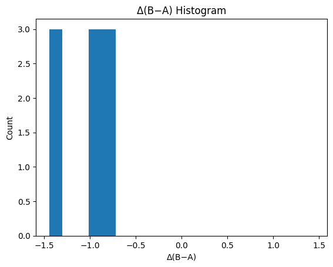
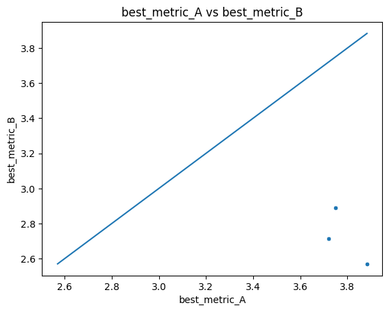
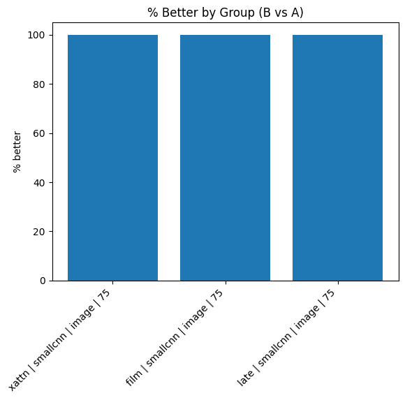
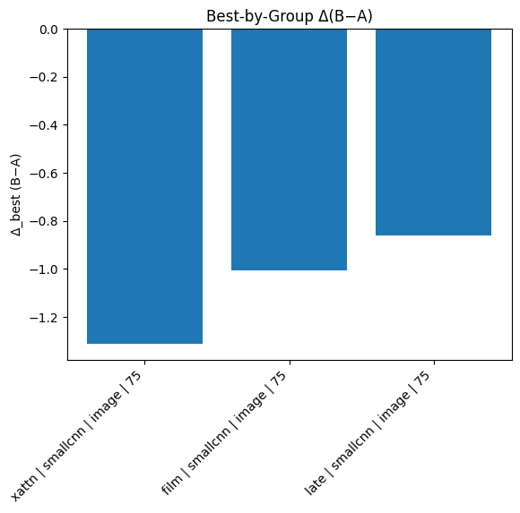

# Summary Comparison Report

**Source A:** `results/sweep/huge_sweep/no_background/small_cnn_2/small_cnn_2_single_summary_runs.csv`  
**Source B:** `results/sweep/huge_sweep/background/small_cnn/small_cnn_single_summary_runs.csv`  
**Metric:** `best_metric`  (lower is better: `True`)  
**Tie tolerance:** `0.01`  
**Matched on keys (28):** `activation_eps, backbone, batch_size, color_space, epochs, features, grad_clip, group_split, hidden_classes_cnt, lr, lr_auto, lr_schedule, meta_dim, meta_encoder, meta_layers, meta_model_name, meta_text_template, metric_kind, model, mse_space, mse_weight_epochs, mse_weight_start, optim, pred_activation, seed, val_split, weight_decay, workers`  
**Ignored columns:** `best_epoch, ckpt_path, run_id`

## At a Glance

- Rows in A: **9**
- Rows in B: **9**
- Unique (by match keys) in A: **9**
- Unique (by match keys) in B: **9**
- Matched: **9**
- Only in A: **0**
- Only in B: **0**

## Best Runs

- **Global best A**: best_metric = 3.7208
- **Global best B**: best_metric = 2.5699
- **Δ(B−A)** on global bests: -1.1509 → **better**

## Top‑K Best Runs within Each Summary

### Top‑K in A
| model   | backbone   | features   |   mse_weight_epochs |   best_metric |
|:--------|:-----------|:-----------|--------------------:|--------------:|
| film    | smallcnn   | image      |                  75 |       3.72077 |
| film    | smallcnn   | image      |                  75 |       3.72077 |
| film    | smallcnn   | image      |                  75 |       3.72077 |
| late    | smallcnn   | image      |                  75 |       3.74972 |
| late    | smallcnn   | image      |                  75 |       3.74972 |
| late    | smallcnn   | image      |                  75 |       3.74972 |
| xattn   | smallcnn   | image      |                  75 |       3.88299 |
| xattn   | smallcnn   | image      |                  75 |       3.88299 |
| xattn   | smallcnn   | image      |                  75 |       3.88299 |

### Top‑K in B
| model   | backbone   | features   |   mse_weight_epochs |   best_metric |
|:--------|:-----------|:-----------|--------------------:|--------------:|
| xattn   | smallcnn   | image      |                  75 |       2.56991 |
| xattn   | smallcnn   | image      |                  75 |       2.56991 |
| xattn   | smallcnn   | image      |                  75 |       2.56991 |
| film    | smallcnn   | image      |                  75 |       2.71362 |
| film    | smallcnn   | image      |                  75 |       2.71362 |
| film    | smallcnn   | image      |                  75 |       2.71362 |
| late    | smallcnn   | image      |                  75 |       2.89025 |
| late    | smallcnn   | image      |                  75 |       2.89025 |
| late    | smallcnn   | image      |                  75 |       2.89025 |

## Matched Verdicts & Δ Stats

- **better**: 9  
- **same**: 0  
- **worse**: 0  

### Delta Stats (B − A)

- mean: -1.0599
- median: -1.0071
- min: -1.3131
- max: -0.8595
- std: 0.2004
- q05/q25/q50/q75/q95: -1.3131 / -1.3131 / -1.0071 / -0.8595 / -0.8595

## Grouped Summary (Matched Head‑to‑Head)

_Grouped by:_ `model, backbone, features, mse_weight_epochs`

| model   | backbone   | features   |   mse_weight_epochs |   matched |   better |   same |   worse |   delta_mean |   delta_median |   pct_better |
|:--------|:-----------|:-----------|--------------------:|----------:|---------:|-------:|--------:|-------------:|---------------:|-------------:|
| xattn   | smallcnn   | image      |                  75 |         3 |        3 |      0 |       0 |    -1.31308  |      -1.31308  |          100 |
| film    | smallcnn   | image      |                  75 |         3 |        3 |      0 |       0 |    -1.00715  |      -1.00715  |          100 |
| late    | smallcnn   | image      |                  75 |         3 |        3 |      0 |       0 |    -0.859468 |      -0.859468 |          100 |

## Best by Group (A vs B Minima per Group)

| model   | backbone   | features   |   mse_weight_epochs |   best_metric_A_best |   best_metric_B_best |   delta_best_B_minus_A | verdict_best   |
|:--------|:-----------|:-----------|--------------------:|---------------------:|---------------------:|-----------------------:|:---------------|
| film    | smallcnn   | image      |                  75 |              3.72077 |              2.71362 |              -1.00715  | better         |
| late    | smallcnn   | image      |                  75 |              3.74972 |              2.89025 |              -0.859468 | better         |
| xattn   | smallcnn   | image      |                  75 |              3.88299 |              2.56991 |              -1.31308  | better         |

**Best-by-group verdicts:** better: 3, same: 0, worse: 0

## Plots

