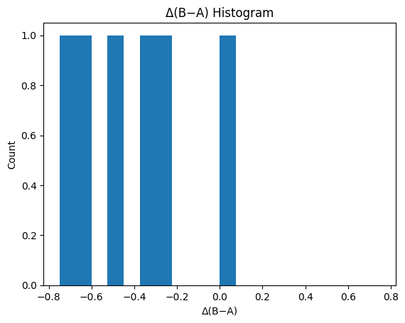
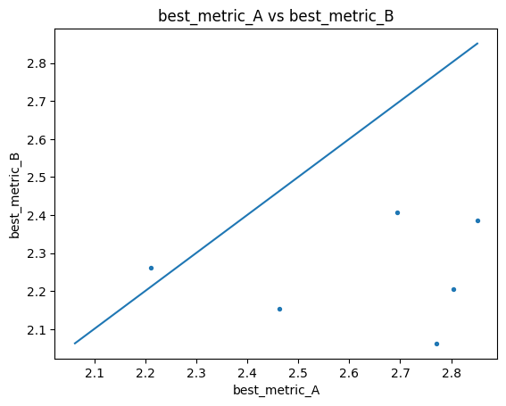
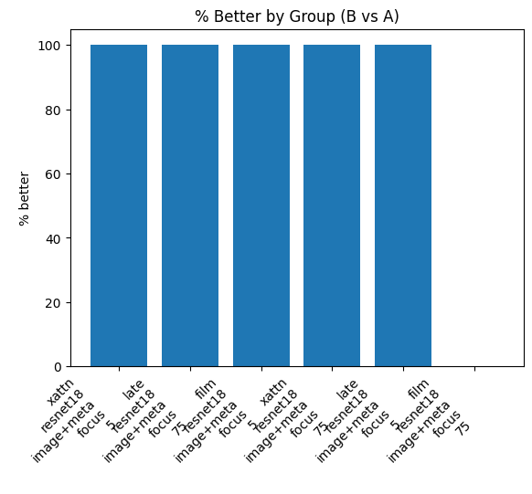
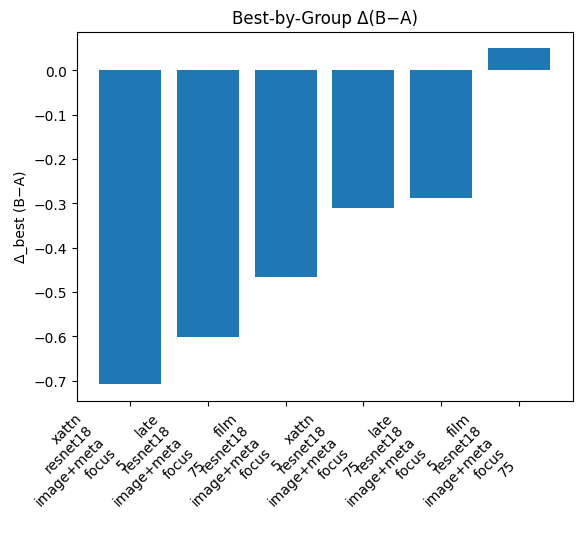

# Summary Comparison Report

**Source A:** `results/sweep/flair1/flair1_summary_runs.csv`  
**Source B:** `results/sweep/flair2/flair2_summary_runs.csv`  
**Metric:** `best_metric`  (lower is better: `True`)  
**Tie tolerance:** `0.01`  
**Matched on keys (11):** `activation_eps, backbone, features, included_folders, lr, model, mse_weight_epochs, mse_weight_start, pred_activation, seed, weight_decay`  
**Ignored columns:** `best_epoch, ckpt_path, run_id`

## At a Glance

- Rows in A: **12**
- Rows in B: **6**
- Unique (by match keys) in A: **12**
- Unique (by match keys) in B: **6**
- Matched: **6**
- Only in A: **6**
- Only in B: **0**

## Best Runs

- **Global best A**: best_metric = 2.1059
- **Global best B**: best_metric = 2.0622
- **Δ(B−A)** on global bests: -0.0437 → **better**

## Top‑K Best Runs within Each Summary

### Top‑K in A
| model   | backbone   | features   | included_folders   |   mse_weight_epochs |   best_metric |
|:--------|:-----------|:-----------|:-------------------|--------------------:|--------------:|
| late    | smallcnn   | image+meta | focus              |                  75 |       2.10588 |
| xattn   | smallcnn   | image+meta | focus              |                  75 |       2.13211 |
| film    | resnet18   | image+meta | focus              |                  75 |       2.21113 |
| xattn   | resnet18   | image+meta | focus              |                  75 |       2.46308 |
| late    | resnet18   | image+meta | focus              |                   5 |       2.69452 |
| late    | smallcnn   | image+meta | focus              |                   5 |       2.70104 |
| xattn   | resnet18   | image+meta | focus              |                   5 |       2.77025 |
| late    | resnet18   | image+meta | focus              |                  75 |       2.80492 |
| film    | smallcnn   | image+meta | focus              |                   5 |       2.83307 |
| film    | resnet18   | image+meta | focus              |                   5 |       2.85123 |

### Top‑K in B
| model   | backbone   | features   | included_folders   |   mse_weight_epochs |   best_metric |
|:--------|:-----------|:-----------|:-------------------|--------------------:|--------------:|
| xattn   | resnet18   | image+meta | focus              |                   5 |       2.06222 |
| xattn   | resnet18   | image+meta | focus              |                  75 |       2.15335 |
| late    | resnet18   | image+meta | focus              |                  75 |       2.20425 |
| film    | resnet18   | image+meta | focus              |                  75 |       2.26112 |
| film    | resnet18   | image+meta | focus              |                   5 |       2.38497 |
| late    | resnet18   | image+meta | focus              |                   5 |       2.40741 |

## Matched Verdicts & Δ Stats

- **better**: 5  
- **same**: 0  
- **worse**: 1  

### Delta Stats (B − A)

- mean: -0.3870
- median: -0.3880
- min: -0.7080
- max: 0.0500
- std: 0.2690
- q05/q25/q50/q75/q95: -0.6812 / -0.5671 / -0.3880 / -0.2928 / -0.0343

## Grouped Summary (Matched Head‑to‑Head)

_Grouped by:_ `model, backbone, features, included_folders, mse_weight_epochs`

| model   | backbone   | features   | included_folders   |   mse_weight_epochs |   matched |   better |   same |   worse |   delta_mean |   delta_median |   pct_better |
|:--------|:-----------|:-----------|:-------------------|--------------------:|----------:|---------:|-------:|--------:|-------------:|---------------:|-------------:|
| xattn   | resnet18   | image+meta | focus              |                   5 |         1 |        1 |      0 |       0 |   -0.708035  |     -0.708035  |          100 |
| late    | resnet18   | image+meta | focus              |                  75 |         1 |        1 |      0 |       0 |   -0.600671  |     -0.600671  |          100 |
| film    | resnet18   | image+meta | focus              |                   5 |         1 |        1 |      0 |       0 |   -0.466265  |     -0.466265  |          100 |
| xattn   | resnet18   | image+meta | focus              |                  75 |         1 |        1 |      0 |       0 |   -0.309724  |     -0.309724  |          100 |
| late    | resnet18   | image+meta | focus              |                   5 |         1 |        1 |      0 |       0 |   -0.287108  |     -0.287108  |          100 |
| film    | resnet18   | image+meta | focus              |                  75 |         1 |        0 |      0 |       1 |    0.0499874 |      0.0499874 |            0 |

## Best by Group (A vs B Minima per Group)

| model   | backbone   | features   | included_folders   |   mse_weight_epochs |   best_metric_A_best |   best_metric_B_best |   delta_best_B_minus_A | verdict_best   |
|:--------|:-----------|:-----------|:-------------------|--------------------:|---------------------:|---------------------:|-----------------------:|:---------------|
| film    | resnet18   | image+meta | focus              |                   5 |              2.85123 |              2.38497 |             -0.466265  | better         |
| film    | resnet18   | image+meta | focus              |                  75 |              2.21113 |              2.26112 |              0.0499874 | worse          |
| late    | resnet18   | image+meta | focus              |                   5 |              2.69452 |              2.40741 |             -0.287108  | better         |
| late    | resnet18   | image+meta | focus              |                  75 |              2.80492 |              2.20425 |             -0.600671  | better         |
| xattn   | resnet18   | image+meta | focus              |                   5 |              2.77025 |              2.06222 |             -0.708035  | better         |
| xattn   | resnet18   | image+meta | focus              |                  75 |              2.46308 |              2.15335 |             -0.309724  | better         |

**Best-by-group verdicts:** better: 5, same: 0, worse: 1

## Only in A (not matched in B) — count: 6

## Plots

