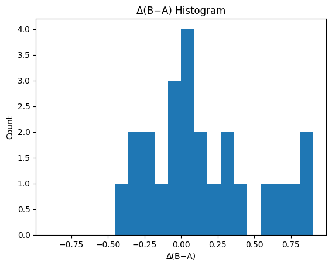
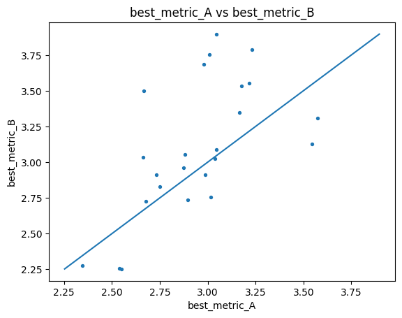
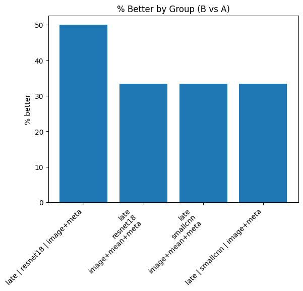
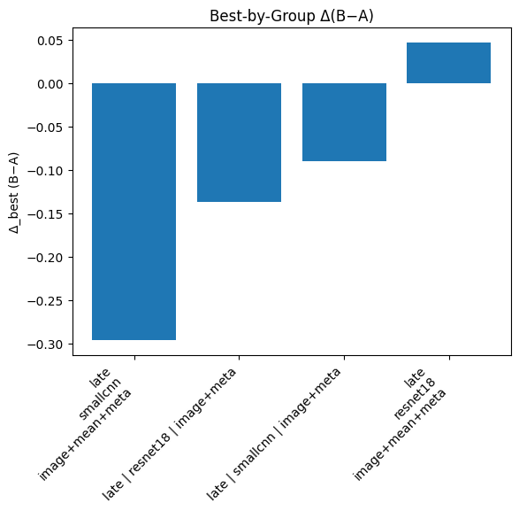

# Summary Comparison Report

**Source A:** `results/sweep/compare-old/compare-old_summary_runs.csv`  
**Source B:** `results/sweep/compare-new/compare-new_summary_runs.csv`  
**Metric:** `best_metric`  (lower is better: `True`)  
**Tie tolerance:** `0.01`  
**Matched on keys (10):** `activation_eps, backbone, excluded_folders, features, lr, model, mse_weight_epochs, mse_weight_start, pred_activation, weight_decay`  
**Ignored columns:** `best_epoch, ckpt_path, run_id, seed`

## At a Glance

- Rows in A: **24**
- Rows in B: **24**
- Unique (by match keys) in A: **24**
- Unique (by match keys) in B: **24**
- Matched: **24**
- Only in A: **0**
- Only in B: **0**

## Best Runs

- **Global best A**: best_metric = 2.3443
- **Global best B**: best_metric = 2.2529
- **Δ(B−A)** on global bests: -0.0915 → **better**

## Top‑K Best Runs within Each Summary

### Top‑K in A
| model   | backbone   | features        |   best_metric |
|:--------|:-----------|:----------------|--------------:|
| late    | smallcnn   | image+meta      |       2.34434 |
| late    | smallcnn   | image+meta      |       2.53988 |
| late    | smallcnn   | image+mean+meta |       2.54917 |
| late    | smallcnn   | image+mean+meta |       2.66423 |
| late    | smallcnn   | image+meta      |       2.66518 |
| late    | resnet18   | image+mean+meta |       2.67806 |
| late    | smallcnn   | image+mean+meta |       2.73203 |
| late    | resnet18   | image+mean+meta |       2.75131 |
| late    | resnet18   | image+meta      |       2.87469 |
| late    | resnet18   | image+meta      |       2.88185 |

### Top‑K in B
| model   | backbone   | features        |   best_metric |
|:--------|:-----------|:----------------|--------------:|
| late    | smallcnn   | image+mean+meta |       2.25288 |
| late    | smallcnn   | image+meta      |       2.25438 |
| late    | smallcnn   | image+meta      |       2.27843 |
| late    | resnet18   | image+mean+meta |       2.72476 |
| late    | resnet18   | image+meta      |       2.73819 |
| late    | smallcnn   | image+mean+meta |       2.75412 |
| late    | resnet18   | image+mean+meta |       2.82687 |
| late    | resnet18   | image+mean+meta |       2.91171 |
| late    | smallcnn   | image+mean+meta |       2.91246 |
| late    | resnet18   | image+meta      |       2.95932 |

## Matched Verdicts & Δ Stats

- **better**: 9  
- **same**: 0  
- **worse**: 15  

### Delta Stats (B − A)

- mean: 0.1540
- median: 0.0801
- min: -0.4154
- max: 0.8524
- std: 0.3740
- q05/q25/q50/q75/q95: -0.2947 / -0.0971 / 0.0801 / 0.3612 / 0.8205

## Grouped Summary (Matched Head‑to‑Head)

_Grouped by:_ `model, backbone, features`

| model   | backbone   | features        |   matched |   better |   same |   worse |   delta_mean |   delta_median |   pct_better |
|:--------|:-----------|:----------------|----------:|---------:|-------:|--------:|-------------:|---------------:|-------------:|
| late    | resnet18   | image+meta      |         6 |        3 |      0 |       3 |   -0.0667857 |     -0.0366892 |      50      |
| late    | resnet18   | image+mean+meta |         6 |        2 |      0 |       4 |    0.120369  |      0.0611359 |      33.3333 |
| late    | smallcnn   | image+mean+meta |         6 |        2 |      0 |       4 |    0.129444  |      0.112271  |      33.3333 |
| late    | smallcnn   | image+meta      |         6 |        2 |      0 |       4 |    0.4328    |      0.630719  |      33.3333 |

## Best by Group (A vs B Minima per Group)

| model   | backbone   | features        |   best_metric_A_best |   best_metric_B_best |   delta_best_B_minus_A | verdict_best   |
|:--------|:-----------|:----------------|---------------------:|---------------------:|-----------------------:|:---------------|
| late    | resnet18   | image+mean+meta |              2.67806 |              2.72476 |              0.0467047 | worse          |
| late    | resnet18   | image+meta      |              2.87469 |              2.73819 |             -0.1365    | better         |
| late    | smallcnn   | image+mean+meta |              2.54917 |              2.25288 |             -0.296287  | better         |
| late    | smallcnn   | image+meta      |              2.34434 |              2.25438 |             -0.0899623 | better         |

**Best-by-group verdicts:** better: 3, same: 0, worse: 1

## Plots

